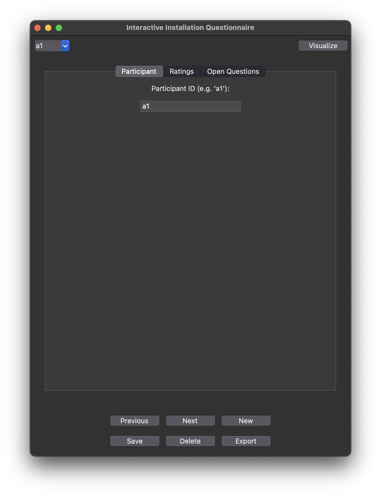
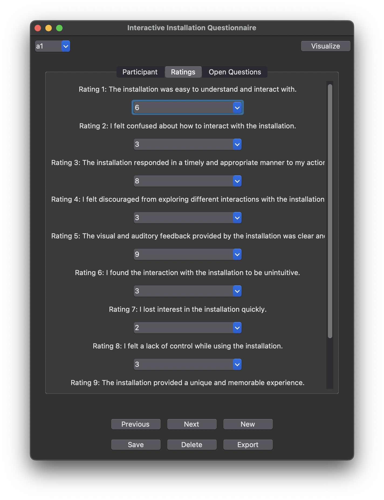
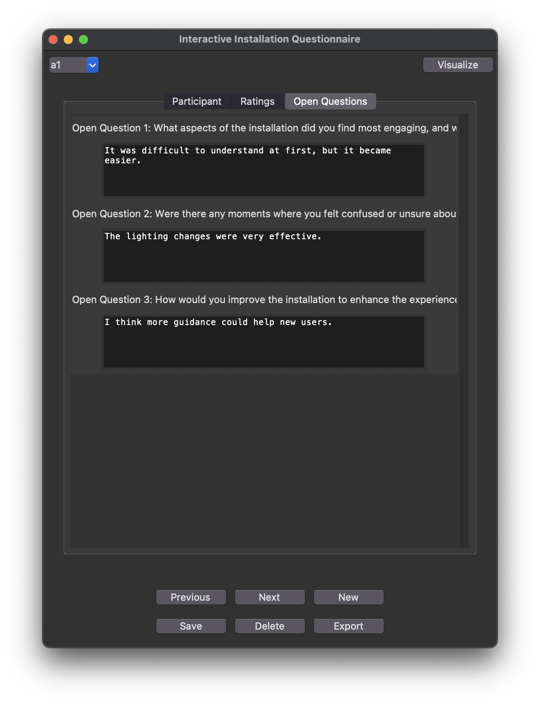
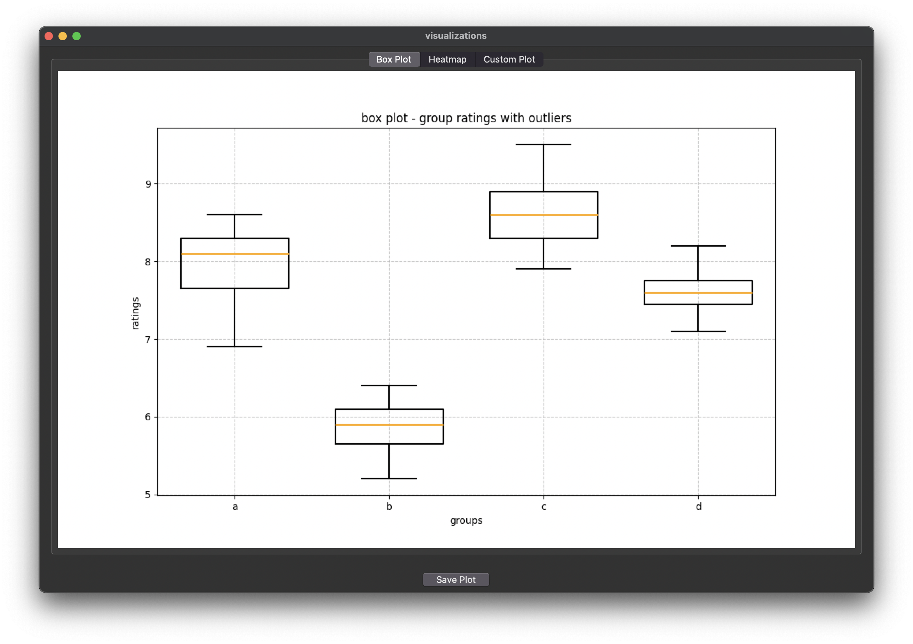
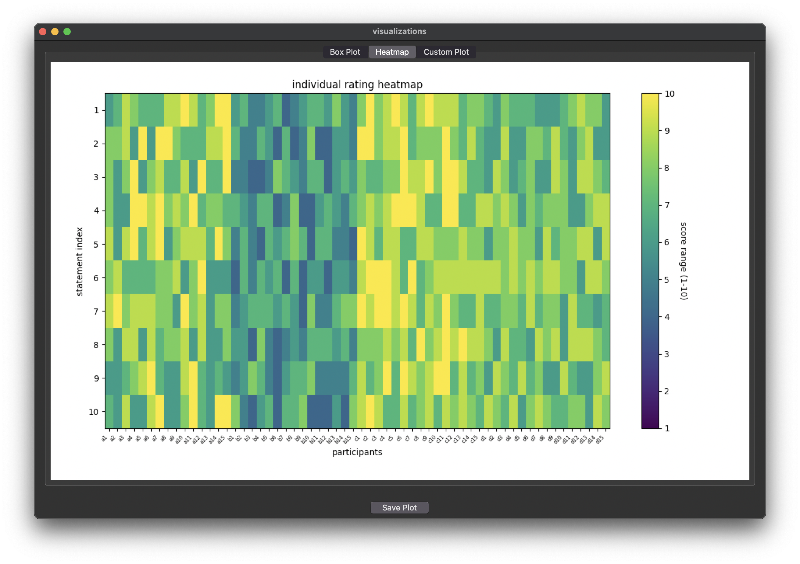
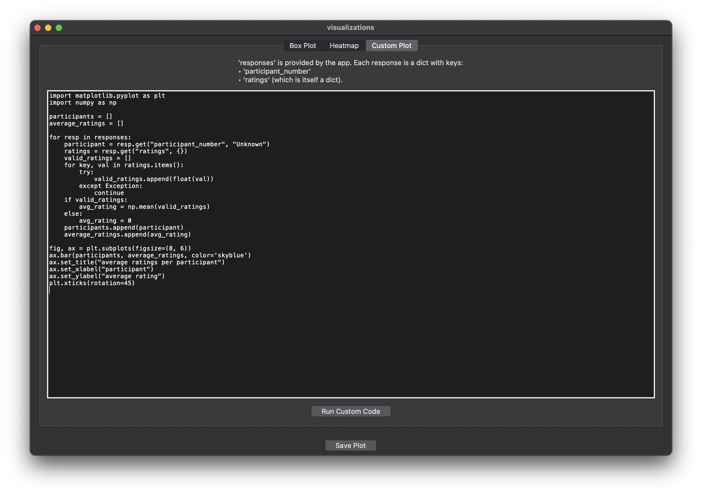
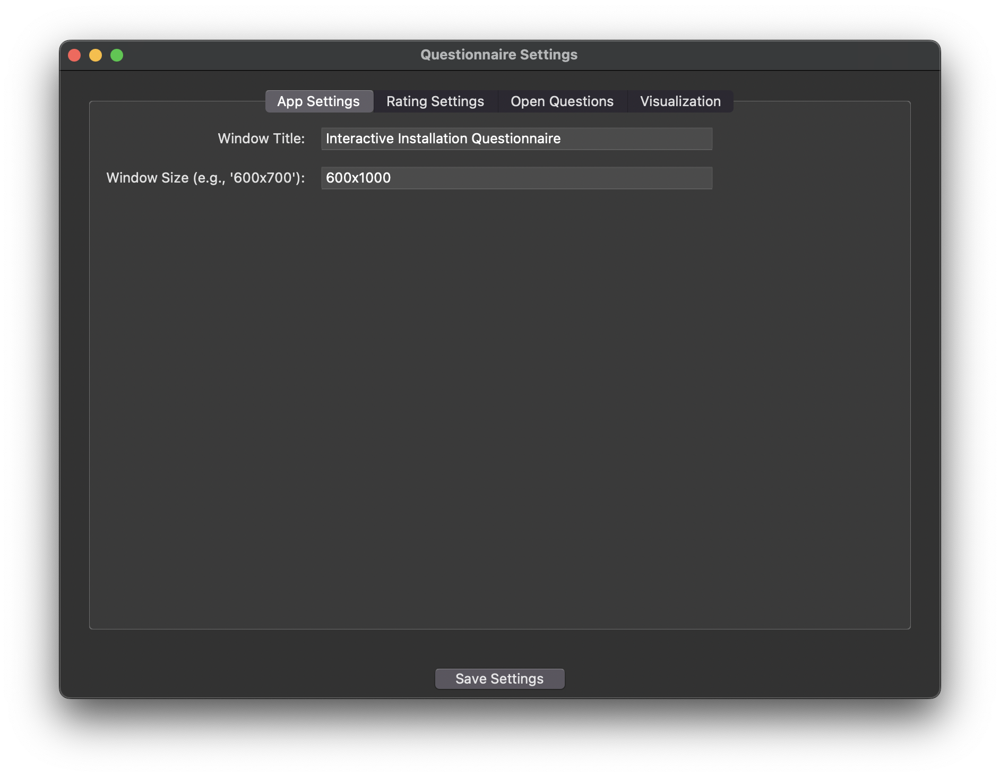
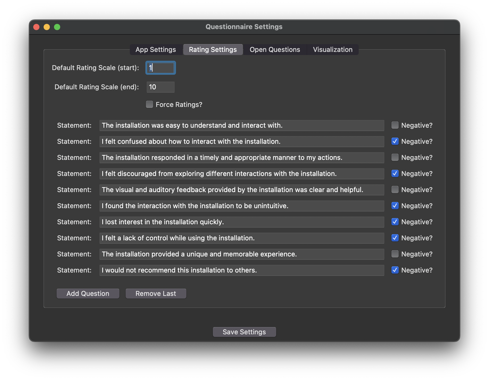
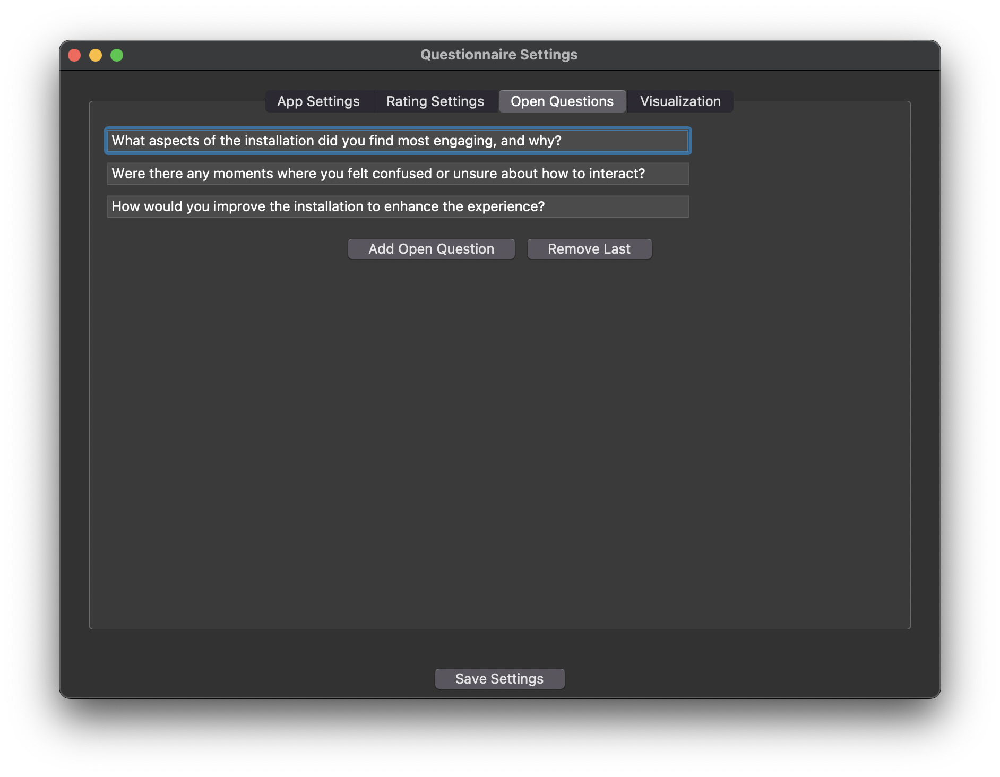
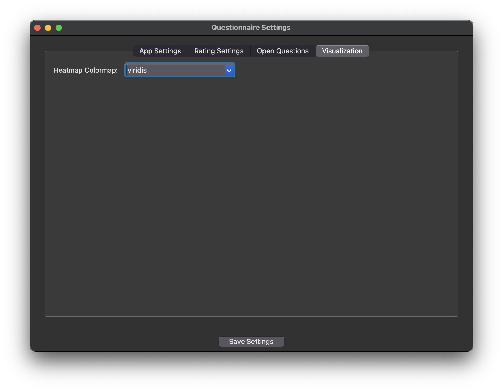

# AskItAll data collector

## Overview

The questionnaire system consists of two main components:

1. **Main Questionnaire App** (`main.py`)  
   - An application that allows users to enter participant responses, navigate records, visualize data, and export results.
   
2. **Settings App** (`settings.py`)  
   - A configuration editor that allows modification of the survey structure, rating scales, and visualization settings via `config.json`.

## Main App

Ensure `main.py`, `settings.py` reside in the same folder.  
If no config file or questionnaire ratings is found, the app creates `config.json` and/or `questionnaire_responses.json` upon saving your first participant or configuration.

### Features

1. **Enter a Participant ID** (like `"a1, a2, b1"` etc.).
2. **Fill Out Questions**: numeric ratings in comboboxes and free-text answers.
3. **Save the record.**
4. **Navigate** among participants or create a new one.
5. **Visualize the data** by using the box plot to see the group average or the heatmap for individual participant data.
6. **Advanced visualisation** using custom code using `matplotlib` code to create new graphs.
6. **Export** if you need CSV or TXT data.

## Settings App

### Features


- **Window Title and Size** of the main app.
- **Default Rating Range** and whether to force rating answers.
- **Statements for rating questions**, marking certain questions as “negative” if desired.
- **Open-Ended Questions** to gather qualitative feedback.
- **Visualization Defaults** (for now it's just changing the colorscheme of the heatmap).

By clicking **Save**, these settings are persisted in `config.json`, and the main app will reflect them next time it launches.

### Configuration Management
- **File:** `config.json`
- **Sections:**
  - `app_settings`
  - `rating_settings`
  - `open_questions_settings`
  - `visualization_settings`

Whenever you modify something in the Settings App (e.g., add a new rating question), that information is written to `config.json`.

## Installing required libraries
```
pip install matplotlib numpy pandas
```
## Running the Apps

```
python settings.py
```

```
python main.py
```


- Changes are persisted once you click **Save Settings**.
- If `config.json` doesn’t exist, it will be created once clicking **Save Settings** .

---

## Configuration File Structure

Typical layout for `config.json`:

```json
{
  "app_settings": {
    "window_title": "Interactive Installation Questionnaire",
    "window_size": "600x1000"
  },
  "rating_settings": {
    "questions": [
      {
        "statement": "The installation was easy to understand and interact with.",
        "is_negative": false
      },
      {
        "statement": "I felt confused about how to interact with the installation.",
        "is_negative": true
      },
      {
        "statement": "The installation responded in a timely and appropriate manner to my actions.",
        "is_negative": false
      },
      {
        "statement": "I felt discouraged from exploring different interactions with the installation.",
        "is_negative": true
      },
      {
        "statement": "The visual and auditory feedback provided by the installation was clear and helpful.",
        "is_negative": false
      },
      {
        "statement": "I found the interaction with the installation to be unintuitive.",
        "is_negative": true
      },
      {
        "statement": "I lost interest in the installation quickly.",
        "is_negative": true
      },
      {
        "statement": "I felt a lack of control while using the installation.",
        "is_negative": true
      },
      {
        "statement": "The installation provided a unique and memorable experience.",
        "is_negative": false
      },
      {
        "statement": "I would not recommend this installation to others.",
        "is_negative": true
      }
    ],
    "default_rating_range": [
      1,
      10
    ],
    "force_ratings": false
  },
  "open_questions_settings": {
    "questions": [
      "What aspects of the installation did you find most engaging, and why?",
      "Were there any moments where you felt confused or unsure about how to interact?",
      "How would you improve the installation to enhance the experience?"
    ]
  },
  "visualization_settings": {
    "plot_defaults": {
      "heatmap_colormap": "viridis"
    }
  }
}
```

Typical layout for `questionnaire_responses.json`:
```json
    {
        "participant_number": "a1",
        "ratings": {
            "rating_1": 6,
            "rating_2": 3,
            "rating_3": 8,
            "rating_4": 3,
            "rating_5": 9,
            "rating_6": 3,
            "rating_7": 2,
            "rating_8": 3,
            "rating_9": 6,
            "rating_10": 4
        },
        "open_answers": {
            "open_1": "It was difficult to understand at first, but it became easier.",
            "open_2": "The lighting changes were very effective.",
            "open_3": "I think more guidance could help new users."
        }
    },
```


---

## Full Workflow Summary

1. **Open the Settings App**
   - Edit the rating range, add/remove questions, change the heatmap colormap, etc.
   - Save changes to `config.json`.

2. **Run the Main App**
   - It reads the updated settings.
   - Presents the newly configured questionnaire to participants.
   - Collects and stores responses.

3. **Visualize**
   - Use the built-in box plot and heatmap.
   - Write custom Python code for deeper analysis.

4. **Export**
   - Download all data as CSV or plain text.

5. **Iterate**
   - Modify the survey as needed in the Settings App.

---

## Additional Considerations

- **Versioning & Backups:** Use version control to track changes to `config.json`.

---

## Screenshots













